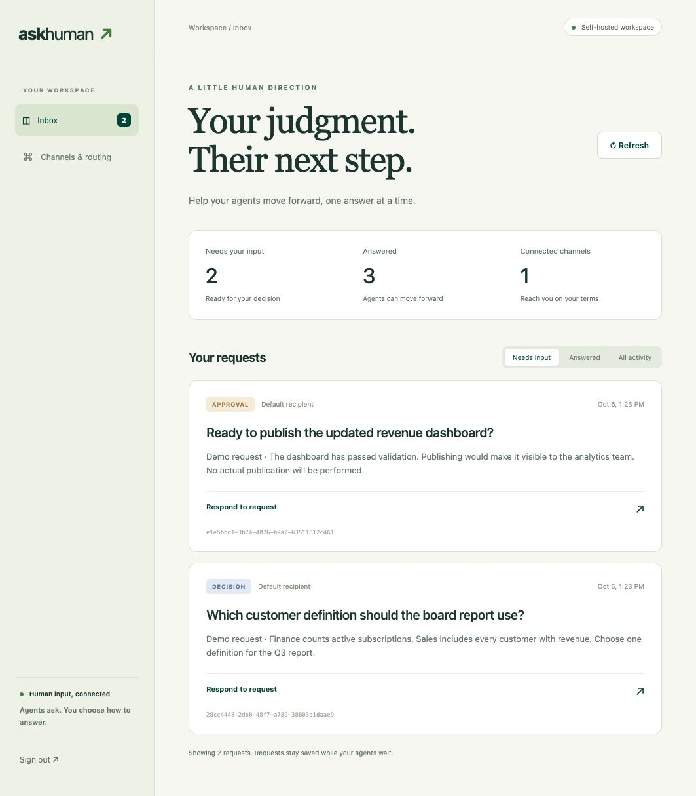

# askhuman ↗

**Give your agent a human when it gets stuck.**

AskHuman runs inside your Python process, like an embedded database. Import it, ask a
question, and continue with a structured human answer. The default terminal channel needs
no server, account, API key, or initialization command.

```python
from askhuman import AskHuman

async with AskHuman() as human:
    answer = await human.decide(
        "Which customer definition should this report use?",
        options=["Active subscription", "Any customer with revenue"],
    )
    print(answer.selected_option)
```

Humans configure how agents reach them. Embedded mode supports terminal input, Telegram
replies through polling, and Slack thread replies through Socket Mode. An optional HTTP
service provides a shared web inbox and additional channels.

## Try it locally

Python 3.11+ is required. This package is not yet published to PyPI or npm.

```sh
git clone https://github.com/alevtdagen/askhuman.git
cd askhuman
python3 -m venv .venv
source .venv/bin/activate
pip install -e .
python examples/python_agent.py
```

Answer in the terminal. Requests and responses are saved in `.askhuman/embedded.sqlite3`.
The core depends on `httpx` and `pydantic`; FastAPI, MCP, and Slack SDK dependencies are
optional. Nothing listens on a network port in embedded mode.

You can also use the CLI:

```sh
askhuman ask 'Which database should I use?' --kind decision --option Postgres --option BigQuery
```

The Python `ask_human(...)` convenience function uses the same default configuration.
For concurrent questions, share one `AskHuman` instance and use `asyncio.gather(...)`.

## Let the human choose a channel

```sh
askhuman configure                       # interactive channel setup
askhuman configure --channel telegram    # a dedicated bot and allowed human user IDs
pip install -e '.[slack]'
askhuman configure --channel slack       # bot token, app token, channel, allowed user IDs
```

Choose one setup command for your initial configuration. The command writes a private
`.askhuman/config.json` file and refuses to overwrite an existing file accidentally.
Edit that file or import a complete replacement with `askhuman configure --from-file FILE`.
Changes take effect when you create a new `AskHuman` instance. Tokens may be environment
references such as `env:TELEGRAM_BOT_TOKEN`.

The agent still calls `human.ask(...)`; it does not choose delivery credentials.
Recipient aliases such as `recipient="data-owner"` map to human-configured channels.
Multiple channels can receive a question; the first valid answer wins.
See [embedded channel setup](docs/embedded.md) for configuration examples and permissions.

## Ask, decide, approve

```python
async with AskHuman() as human:
    detail = await human.clarify("Which dataset is authoritative?")
    choice = await human.decide("Which approach?", options=["Fast", "Thorough"])
    approval = await human.approve(
        "Deploy commit abc123 to staging?",
        context="Tests passed. This changes the staging API and is reversible.",
        timeout_seconds=3600,
    )
    if approval.approved is True:
        print("The described deployment was approved.")
    await human.notify("The report is ready for review.")
```

An answer includes `request_id`, `answer`, `selected_option`, `approved`, `respondent`,
`timestamp`, and `source`. Approval always requires an explicit choice. For direct channels,
reply `Approve` / `Reject`, or the displayed option number. Generic prose such as “yes”
does not grant approval. For decisions, use the exact option label or its number.

Telegram/Slack replies must come from a configured human ID in the configured chat/thread.
Their respondent values are provider IDs such as `telegram:123` or `slack:U123`.
Terminal respondent labels identify the local OS user (or the name entered by the human
CLI operator). Web response names are self-reported. The application still enforces whether
an approved action may actually run.

Other request kinds are `ask`, `expertise`, `verification`, `exception`, and `notification`.
`notify()` returns after its initial delivery attempt, without waiting for an answer.
Its `notified` status means queued; inspect `deliveries` for delivery outcome.

## Persist and resume

```python
from askhuman import AskHuman, HumanTimeout

async with AskHuman(data_dir="./workflow-state") as human:
    request = await human.create(
        "May I publish report Q3 revision 4?",
        kind="approval",
        idempotency_key="report-q3-revision4-publish",
        timeout_seconds=86400,
    )
    # Persist request.id in your workflow state before waiting.
    try:
        answer = await human.wait(request.id, wait_timeout=25)
    except HumanTimeout as pending:
        print(pending.request_id, "expired" if pending.expired else "still pending")
        # Later, even in a new process with the same data_dir:
        # answer = await human.wait(pending.request_id)
```

SQLite stores requests, answers, delivery attempts, message-to-request mappings, and
Telegram update offsets. Retrying the same question with the same idempotency key reuses
its ID. Reusing a key for different input fails with a conflict. Deadlines, cancellations,
and single-winner responses are enforced by the shared store in both modes.

`wait_timeout` limits a waiting session; `timeout_seconds` sets the request's lifetime.
A timeout or cancellation of the calling coroutine never becomes an approval and does not
cancel the saved request. Use `human.cancel(id)` when the question is no longer relevant.
Terminal waits are cancellable and do not leave a blocked input thread behind.

Keep the async context open while receiving messaging replies. Closing it stops delivery
and receiver tasks and releases the workspace lock. Telegram can deliver replies retained
by its service when the next process starts (up to 24 hours of retention). Slack Socket Mode
has no offline inbox replay in this release: the process must be running for live replies.
An agent host must resume the saved workflow; AskHuman does not restart agent processes.

Use **one active embedded runtime per data directory and dedicated messaging bot**. Share a
client across tasks in one process. Separate agent processes should use distinct workspaces
and bots, or connect to the optional server. A filesystem lock prevents two embedded runtimes
from consuming the same workspace's replies. Local human `inbox` and `answer` commands can
operate while that runtime is waiting.

## Framework tools, MCP, and skills

The Python API works inside any async agent function. Optional native adapters support
OpenAI Agents SDK and LangChain/LangGraph, with portable JSON Schema tools for OpenAI,
Anthropic, Gemini, and custom runtimes. See [integration recipes](docs/integrations.md).
All Python adapters use the embedded engine by default.

For MCP hosts:

```sh
pip install -e '.[mcp]'
```

```json
{
  "mcpServers": {
    "askhuman": {
      "command": "/absolute/path/to/askhuman/.venv/bin/askhuman-mcp",
      "env": {
        "ASKHUMAN_MODE": "embedded",
        "ASKHUMAN_DATA_DIR": "/absolute/path/to/human-workspace"
      }
    }
  }
}
```

The host launches a stdio process, with no separately deployed HTTP service. Configure a
messaging channel in that workspace, or answer from another terminal:

```sh
export ASKHUMAN_DATA_DIR=/absolute/path/to/human-workspace
askhuman --mode embedded inbox
askhuman --mode embedded answer REQUEST_ID --approve --name 'Sam'
```

MCP never reads terminal input from its protocol stream. Its tools are `ask_human`,
`get_human_response`, `wait_for_human`, and `cancel_human_request`. Each wait is bounded to
25 seconds; pending results retain their IDs for a later call.

Install the reusable agent skill with `askhuman install-skill .agents/skills`. It supports
both modes and teaches agents to preserve IDs, distinguish pending from answered, and
require explicit approvals. The installer never overwrites an existing skill.

## Optional shared service

Use the service when you need a browser inbox, independently running agents, or a receiver
that remains available while agents stop. It retains the original REST API and server-side
adapters for Slack/Teams/Discord webhooks, Telegram notifications, SMTP email, Twilio
SMS/WhatsApp, and signed custom webhooks. Those adapters send browser response links.

```sh
pip install -e '.[server]'
askhuman init
askhuman serve
```

Open <http://127.0.0.1:8765> and sign in with the output of `askhuman token --admin`.
Use `askhuman token` for the agent key. Select HTTP explicitly:

```python
async with AskHuman(base_url="http://127.0.0.1:8765", api_key="your-agent-key") as human:
    answer = await human.ask("Which source should I trust?")
```

`AskHuman(mode="remote")` loads local server settings, while explicit
`ASKHUMAN_BASE_URL` / `ASKHUMAN_API_KEY` environment variables also select remote mode.
`ASKHUMAN_MODE=embedded` forces local operation even if remote environment variables exist.
Use `askhuman --mode remote ...` for CLI commands targeting the service.

The TypeScript package remains an HTTP client for this service. See
[`packages/typescript`](packages/typescript) for build and installation instructions.



[Server channel setup and webhook contracts](docs/channels.md) describe provider credentials,
HTTPS deployment, and the distinction between notifications and direct replies.

## Configuration, trust, and migration from 0.1

- **Default changed:** `AskHuman()` now runs locally. It does not infer remote mode from
  the existence of `.askhuman/settings.json`. Supply `mode="remote"` to retain that behavior.
- **Storage is separate:** embedded state uses `embedded.sqlite3`; the service keeps
  `askhuman.sqlite3` and `settings.json`. Existing server questions are preserved and must
  be resumed through the remote client. No automatic database migration is performed.
- **Configuration:** `ASKHUMAN_DATA_DIR` selects the state directory; `ASKHUMAN_CONFIG` or
  `AskHuman(config="path.json")` selects an embedded routing file. Defaults are local to
  the working directory. Store files securely and use a stable absolute directory for MCP.
- **Process trust:** embedded code can access local state and channel credentials. There
  is no isolation between the agent and the library in one process. Use the service with
  separate operator/agent keys when that boundary matters.
- **Delivery:** retries are at least once, up to five attempts. A crash after a provider
  accepts a message can cause a duplicate notification. Recorded responses remain single-winner.
  Unsupported embedded channels fail with guidance to use the server instead.

This release targets your own trusted humans. It does not provide SSO, multi-tenant RBAC,
a secret vault, or automatic execution of approved actions. Keep credentials out of questions.

## Development

```sh
pip install -e '.[server,mcp,dev,openai,langchain,slack]'
pytest
ruff check src tests examples
ruff format --check src tests examples
python -m build
cd packages/typescript && npm install && npm test
```

Tests cover both runtimes, direct-response identity checks, terminal cancellation,
request persistence, idempotency, approval semantics, delivery contracts, native framework
adapters, and live stdio MCP round trips with no HTTP server. Provider network calls are
mocked; real account delivery requires your own credentials. The server serves OpenAPI at
`/docs`.

The product hypothesis is simple: removing channel-specific human-input code makes agents
easier to build and supervise. Validate real workflow adoption before adding expertise
inference, organizational memory, marketplaces, voice, or mobile push. The competitor and
market-attention claims in the original ideation remain unverified.

Licensed under the [Apache License 2.0](LICENSE). See [NOTICE](NOTICE) for attribution.
